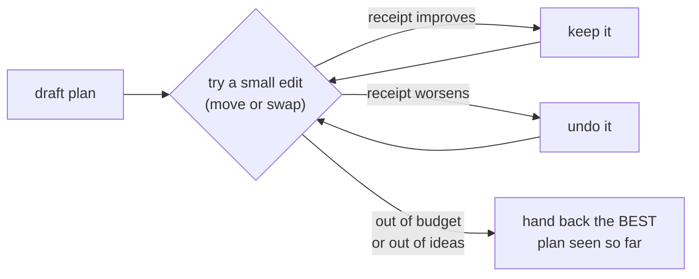

# Phase 5 (slice 2), in plain language — the polisher and the nightly caretaker

*For any reader. Technical record: `../phases/05-sdk.md`; code in
`crates/muster-sdk/src/{search,objective,batch,notify}.rs`.*

## What got built

Slice 1 built an assistant that proposes a decent room plan instantly.
This slice adds two things every real scheduling office has: **someone who
polishes the draft**, and **someone who tidies up every night**.

## The polisher

The first draft is provably fine at its one job — never double-booking —
but "fine" isn't "good". Maybe two sessions that share most of their
audience ended up in buildings ten minutes apart. Maybe a 15-person
workshop sits in the big hall. The polisher takes the draft and tries small
edits, one at a time: *move this session to that room* or *swap these two
sessions' rooms*. After each edit it re-reads the receipt (the itemised
score from slice 1). Better? Keep it and continue. Worse? Put it back.

Four promises, each enforced by an automated test:

* **It can only help.** The polisher returns the best plan it has *seen* —
  which includes the untouched draft. Even interrupted after one step, you
  never get something worse than you started with.
* **It genuinely helps.** On a test built to trip the draft-maker (a small
  room handed out early that a later session needed more), the polisher
  finds the swap and the score provably improves.
* **It respects history.** Real life is rarely "make a schedule from
  nothing" — it's "last term's schedule, but two rooms are being
  renovated." A *stability* line item on the receipt makes every deviation
  from the old schedule cost something, so the polisher only moves what it
  must. In the test, even when it would slightly prefer rearranging
  everything, only the session whose room vanished actually moves. A plan
  5% worse that changes 3 things beats a perfect one that changes 200 —
  because 200 people re-planning their week is a real cost the math should
  see.
* **It's repeatable.** The polisher explores in a shuffled order, but the
  shuffle comes from a seed number you provide. Same inputs, same seed →
  the identical answer, so "why did it pick that?" always has a
  reproducible answer.

One more line item joined the receipt: **expected walking**. If many of
the same people plan to attend two back-to-back sessions, putting those
sessions far apart costs points — weighted by how committed those people
are, using real sign-up data rather than guessing by topic. (Grouping
"similar-sounding" talks was explicitly rejected in the design: it helps
people who follow one track and punishes everyone who hops.)

## The nightly caretaker

Schedules rot quietly: travel times change when a footpath closes, group
membership shifts, conflicts appear while nobody is looking. The caretaker
is one routine that runs the existing machinery in the right order:

1. **Refresh the travel map** — recompute how long it takes between every
   pair of rooms that actually host things.
2. **Recompute everyone's schedule fingerprint** — a tiny summary per
   person that changes only when *their* derived schedule really changed.
   The output is the exact list of affected people.
3. **Re-inspect everything** — file newly-found problems in the inbox,
   close ones whose cause has disappeared, and leave human-granted
   exemptions strictly alone.

It ends with a short report: what was refreshed, **who** needs to be told
their week changed (just those people — nobody gets spammed), and what
problems were opened or closed. Running it twice in a row reports nothing
the second time — proof it's maintaining, not thrashing. Actually *sending*
the notifications is deliberately someone else's job (the app's): this
layer computes who, never how.

## Why this matters

With this slice, the middle layer of the system is functionally complete
for its first application: it can **draft** a schedule, **polish** it,
**explain** it line by line, **respect** the schedule people already have,
and **keep it healthy** unattended. What remains above is the part humans
touch — the app where members pick sessions, coordinators set
expectations, and the problem inbox gets worked. That's Phase 6.
