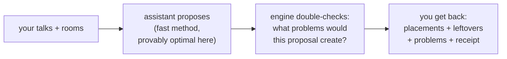

# Phase 5 (slice 1), in plain language — the room-suggestion assistant

*For any reader. The technical record lives in
`../phases/05-sdk.md`; code in `crates/muster-sdk/`.*

## What got built

Imagine you run a conference. You have 40 talks, each with a fixed time
slot, and 6 rooms. Someone has to decide which talk goes in which room —
without ever putting two talks in the same room at the same time, without
putting a 15-person workshop in the 300-seat hall, and without losing track
of any talk that simply doesn't fit anywhere.

This phase built the assistant that does that: you hand it the list of
talks and the list of rooms, and it hands back **a proposed room for every
talk, a list of anything it couldn't place, a list of every problem the
proposal would create, and an itemised "receipt" explaining how good the
proposal is**.

## Why you can trust its core promise

The room-fitting puzzle has a lucky mathematical property. Because every
talk's *time* is already fixed, assigning rooms is like handing out
parking spaces to cars that each arrive and leave at known times: if you
process arrivals in order and give each car any free space, you will
**never** end up needing more spaces than the busiest moment truly
requires. It's a rare case where the simple, fast method is *provably* as
good as any clever one — if a perfect arrangement exists at all, this
method finds one.

We didn't just cite the theorem — we made the computer try to break it.
Random schedules were solved three ways at once: by our assistant, by
brute force (trying every possible arrangement), and by a "busiest
moment" head-count. All three agreed on every single instance.

*(Corrected 2026-08-03, quality review F-6: this paragraph originally
said "thousands of random schedules" — the measured run is pinned at
**48 generated schedules per property** (a documented budget, raisable
via `PROPTEST_CASES` for deep runs), roughly 40× fewer than claimed. The
three-way agreement holds on every instance actually generated; the
count was inflated, not the result.)*

## The receipt — why it's not a black box

A bare "trust me, this is good" is useless to a human who has to defend
the schedule to colleagues. So every suggestion comes with a breakdown,
like an itemised bill:

| line item | what it measures | example |
|---|---|---|
| problem cost | how many rule-breaks the proposal causes, weighted by seriousness | a double-booked room costs 100; a cosmetic warning costs 10 |
| room fit | wasted space and overcrowding | a 12-person meeting in a 300-seat hall shows up here |

The lines always add up exactly to the total — the receipt *is* the score,
not a summary of it. When a later phase adds an automatic improver, you'll
be able to see precisely *which* line item each change improved.

## Three honesty rules baked in

1. **Nothing is silently dropped.** If a talk can't fit anywhere, it comes
   back in a "couldn't place" list rather than quietly vanishing — a
   schedule that loses a talk is worse than one that admits it.
2. **The assistant never grades its own homework.** Whether a proposal
   breaks rules is decided by the engine (the system's referee, built and
   tested in earlier phases) — the assistant just relays the referee's
   findings, word for word. There is one definition of "double-booked" in
   the whole system, on purpose.
3. **Same question, same answer.** Ask twice with the same inputs and you
   get byte-for-byte the same suggestion. No hidden randomness — which
   also means a suggestion can be reproduced later when someone asks
   "why did it pick that room?"

## Why this matters

This is the first piece of the project that *makes* schedules rather than
*checking* them. Everything before it answered "is this arrangement
possible?"; this answers "here's a good arrangement, and here's exactly
why." The next slice teaches it to polish a proposal further (nudging
talks between rooms to cut walking distance and avoid churn when a room
disappears) — the receipt and the honesty rules stay the same.
