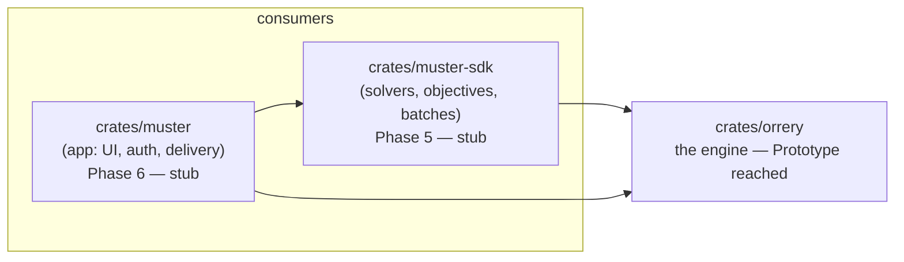
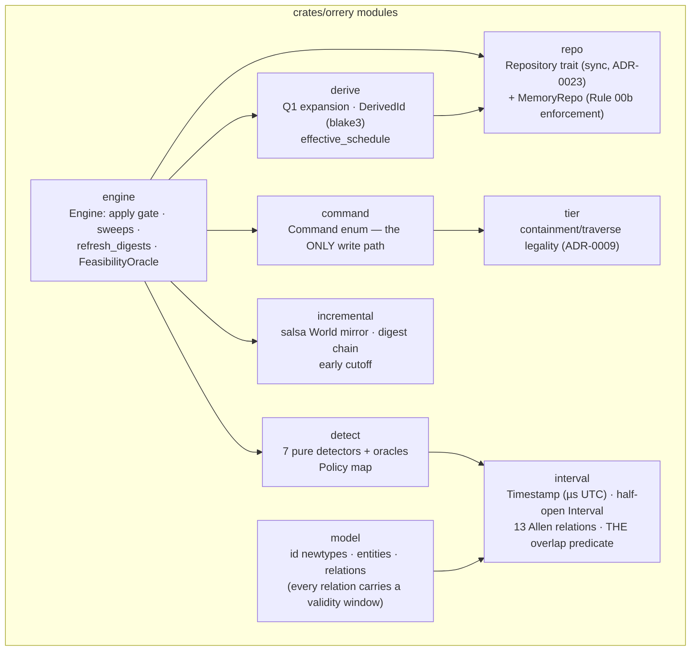
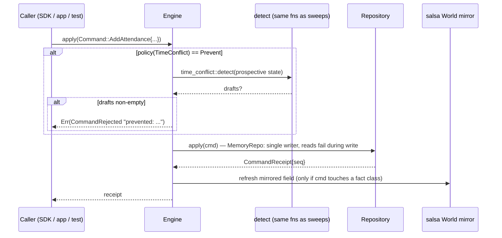

# Phase 3 artifact — Architecture at the Orrery Prototype gate

*State as of 2026-08-02, Phase 3 complete (phases/03-engine-core.md). Sibling
artifacts: [incremental derivation](phase-3-incremental-derivation.md) ·
[violations & oracle](phase-3-violations-and-oracle.md).*

Orrery is a **spatiotemporal feasibility engine**: given people assigned to
events at locations over time, it returns the ways that assignment is
impossible, and a score for how good it is. It does not schedule — deciding
*whether* a schedule is possible is the whole job (searching for one is
Muster-SDK's job, presenting it is Muster's).

## The workspace

Rule 03's test: if trying a different solver would require changing
`orrery`, the boundary is broken. The engine exposes `is_feasible` and
`score`; how a caller searches the space is not its concern.

## Inside the engine

## The write path — one chokepoint

Every mutation, including test seeding and violation records, is a `Command`
variant (Rule 00.2). That single enum is what makes the future event log
(ADR-0016 D) an insertion rather than a refactor: serialize the enum, done.

## Worked example — the two personas, one engine

The PRD stresses one engine with two opposite workloads:

* **Academic advising** (rigid): student `p` self-selects CS-101; their
  advisor's cohort group carries an expectation for the mandatory seminar.
  `effective_schedule(repo, p, window, at)` returns the explicit CS-101 edge
  plus a *derived* seminar edge with provenance (`source_group`), and the
  conflict detector flags the overlap between them — same interval
  predicate as everything else.
* **Conference planning** (soft): an organiser drags a talk into an occupied
  room. Nothing stops the drag — detection, not prevention (Rule 00.4) —
  but the next `is_feasible` overlay evaluation returns the
  `LocationExclusivity` violation and the score drops by its severity
  weight. Local search *needs* to traverse exactly these infeasible states.

## Non-negotiables, as they exist in code today

| Rule 00 item | Where it is enforced |
|---|---|
| Persistence behind a trait | `repo::Repository`; seam check greps the public API for datastore names |
| One command layer | `command::Command`; repositories expose no other write |
| Every relation carries a window | `model` — every relation struct has `during`; `Interval::new` rejects inversions |
| Detection, not prevention | `detect` default policy; `Prevent` is per-kind opt-in running the same detector |
| `feasible(person, …)` signature now | `impossible_travel::detect(person, …)` carries and ignores it; full landing in Phase 4 |
| Anchors never cross the boundary | `Anchors` doc-contract + Rule 09; automated privacy test lands with Phase 4 travel |
| Solver lives in the SDK | `orrery` has no search code and no `rand` |

## Verification posture

50 tests: 15 property suites (interval algebra, all 7 detectors, derivation,
incremental-vs-cold fuzz) each against an independently-written naive
oracle; DST fixtures with real 2026 transition instants (ADR-0024); early
cutoff asserted by execution counters, not assumed; Rule-00b constraint
errors asserted by name. Gates: `cargo nextest`, `clippy -D warnings`,
`fmt`, seam grep, xref audit.

## Datastore status (the one open decision)

ADR-0015 stays `proposed`. Funnel: Stage A screened 20 candidates → Grafeo,
agdb, Cozo (owner risk-acceptance); Stage B (Rust harness) eliminated
nobody at M scale but recorded qualitative findings against Grafeo (an
evaluator bug, no single-statement Q1, a planner cliff, 600× join gap).
Stage C / Phase 7 decides through real repository implementations against
the pre-committed ADR-0015 criteria. Everything above runs on `MemoryRepo`,
which deliberately enforces the *most restrictive* surviving-candidate
constraints so the trait can't silently absorb permissive-store assumptions.
