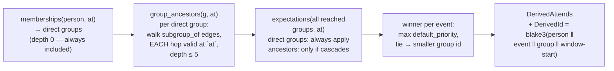
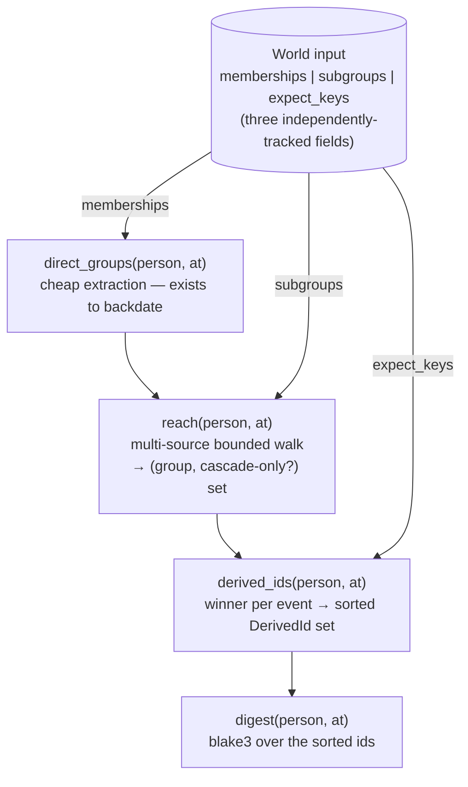
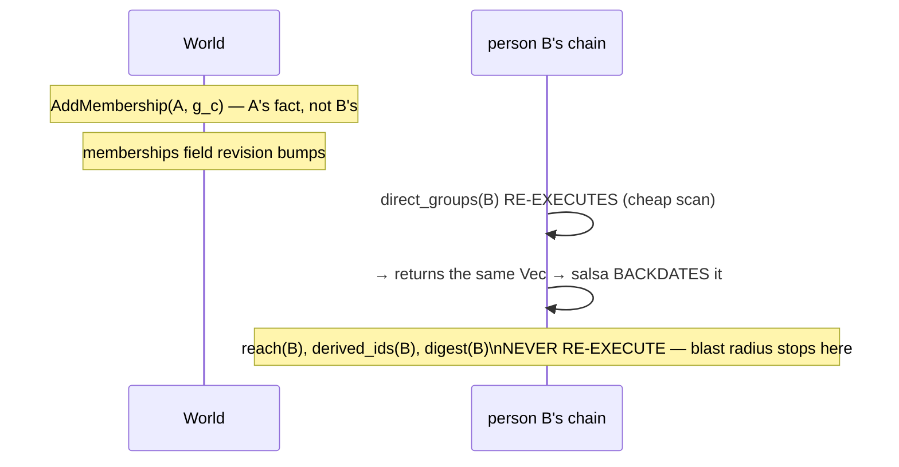

# Phase 3 artifact — Derivation, salsa, and digests

*State as of 2026-08-02. Code: `crates/orrery/src/{derive,incremental}.rs`,
`engine.rs`. Decisions: ADR-0004 (derive, don't materialise), ADR-0016
(change detection), ADR-0024 (time).*

## The problem this machinery solves

Group expectations are **derived, not materialised** (ADR-0004): when a
coordinator says "cohort-26 is expected at the kickoff", no `attends` rows
are written. Instead, each person's derived schedule is *computed* from
memberships + group hierarchy + expectations. That kills drift bugs — but
it creates the central engineering problem of this engine:

> **A single `member_of` write silently changes hundreds of people's
> derived schedules, with no write anywhere you could observe.**

The blast radius of a write is unbounded and invisible. Everything in this
document exists to make it *computed* instead of guessed.

## How derivation reads (the Q1 expansion)

`derive::expand(repo, person, at)` — the cold path, pure repository reads:



Two details are load-bearing:

* **Per-hop filtering, not whole-path**: an expired mid-chain
  `subgroup_of` edge prunes the traversal *at that hop* — its whole subtree
  contributes nothing. (This is the datastore stop-gate requirement; the
  SPEC-05 critical fixture tests exactly this.)
* **Depth 0 counts**: a person's *direct* group's expectations always
  apply. Phase 0 found the original benchmark implemented this wrong
  (`*1..5`); the correct semantics are now triple-implemented (cold path,
  salsa chain, screening harness) and cross-checked.

`effective_schedule` unions this with explicit attendance — an explicit
edge for the same event **shadows** the derived one, which is how user
overrides survive recomputation.

## What salsa is, and what it is doing here

[Salsa](https://docs.rs/salsa) (v0.28 — the incremental-computation
framework behind rust-analyzer) memoizes function results **and records
which inputs each computation actually read**. When an input changes, salsa
bumps a revision; the next query lazily re-validates only the computations
whose transitive inputs changed. Its killer feature is **early cutoff
(backdating)**: when a re-executed function returns a value *equal* to its
previous one, salsa keeps the old revision stamp — so everything downstream
sees "nothing changed" and never re-executes.

ADR-0016's reframe: blast radius is not a database problem, it is an
incremental-computation problem. Salsa is the machinery that makes
"recompute only what a write actually affected" a property of the runtime
rather than a hope.

## The three fact classes

The derived chain reads exactly three kinds of base fact, so exactly three
are mirrored into the salsa `World` input — nothing else can invalidate it:

| Fact class | Source relation | Why the chain needs it |
|---|---|---|
| **Memberships** | `member_of` (person → group, windowed, role) | step 1: which groups is this person directly in at `at`? |
| **Subgroup edges** | `subgroup_of` (group → group, windowed) | step 2: the hierarchy walk, filtered per hop |
| **Expectation keys** | `expects`, projected to `ExpectKey` | step 3: which events flow from those groups |

`ExpectKey` is a *float-free projection*: `{group, event, window start/end,
cascades, priority_key}` where `priority_key` is `default_priority` as an
**order-preserving bit pattern** (u32). Two reasons floats are banned from
the chain: backdating compares with `PartialEq` and must be exact, and the
digest must depend on the *id set*, never on priorities. The bit-encoding
exists because the winner-per-event rule still needs priority *ordering* —
this was the phase's near-refutation: without it, the chain and the cold
path picked different winners and produced different ids. The
incremental-vs-cold fuzz exists to catch exactly that class of bug.

Writes map to mirror refreshes 1:1 — `AddMembership` → memberships field,
`AddSubgroup` → subgroups field, `AddExpectation` → expect-keys field.
No other command touches the mirror at all.

## How incrementality is implemented

Four tracked functions, keyed `(World, PersonId, at)`:



Early cutoff in action — the scenario the counters assert
(`tests/incremental_cutoff_*.rs`):



Two measured facts from the tests:

1. **Unrelated person**: after A's membership write, B's `derived_ids` and
   `digest` execution counters do not move. Only the extraction layer
   re-ran.
2. **Finer than designed**: salsa 0.28 tracks dependencies per input
   *field*. An expectation write bumps only `expect_keys`, so even A's own
   `direct_groups`/`reach` (which read only memberships/subgroups) never
   re-execute — `derived_ids` re-runs, finds the same set, and the digest
   backdates mid-chain.

Correctness is not assumed either: `prop_incremental_digest_matches_cold`
fuzzes random command sequences and asserts the salsa digest equals a
digest computed cold from `derive::expand` for every person, every case —
two independent read paths that must always agree.

## How digests function, and why

**A digest is `blake3(sorted derived-edge id set)` for one person**
(ADR-0016 B). It answers one question cheaply: *did this person's derived
schedule change?* — without saying what changed (a second pass diffs, and
priorities deliberately don't affect it, since ids are priority-free).

Persistence: on the person record itself, written through
`Command::SetDerivedDigest` — **no second store**, preserving the
sole-system-of-record premise until the event log (v2).

`Engine::refresh_digests(at)` recomputes every person's digest (memoized —
unchanged people cost a backdated lookup), persists the ones that differ
from the stored record, and **returns exactly the changed set**:

```text
// A coordinator adds one expectation to cohort-26 (400 members):
let changed = engine.refresh_digests(at)?;   // → 37 PersonIds
// Only 37 people's derived schedules actually changed (the other 363
// already attended those events explicitly, or their membership had
// lapsed). Muster-SDK notifies those 37 — nobody else.
```

That changed-set is the change-notification primitive the SDK's batch flow
consumes (PRD muster-sdk Flow C), and the blast-radius preview Muster shows
coordinators *before* they commit a group-level change.

## Use-case walkthrough

Advising: registrar moves student `p` from section-A to section-B
mid-semester (`AddMembership` with a new window). The mirror bumps
memberships; `p`'s chain re-derives (their facts really changed); the other
9,999 students' chains stop at a backdated extraction. `refresh_digests`
returns `[p]`; the SDK recomputes only `p`'s conflicts and notifies only
`p`. Cost of the write scales with the *actual* blast radius — one person —
not the population.
