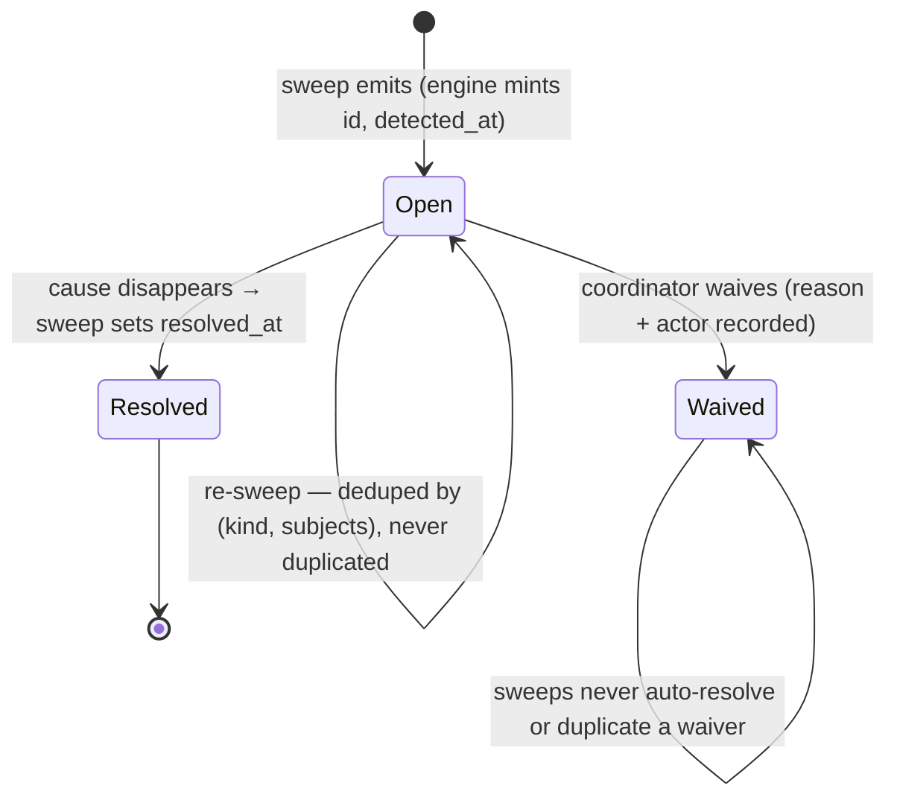
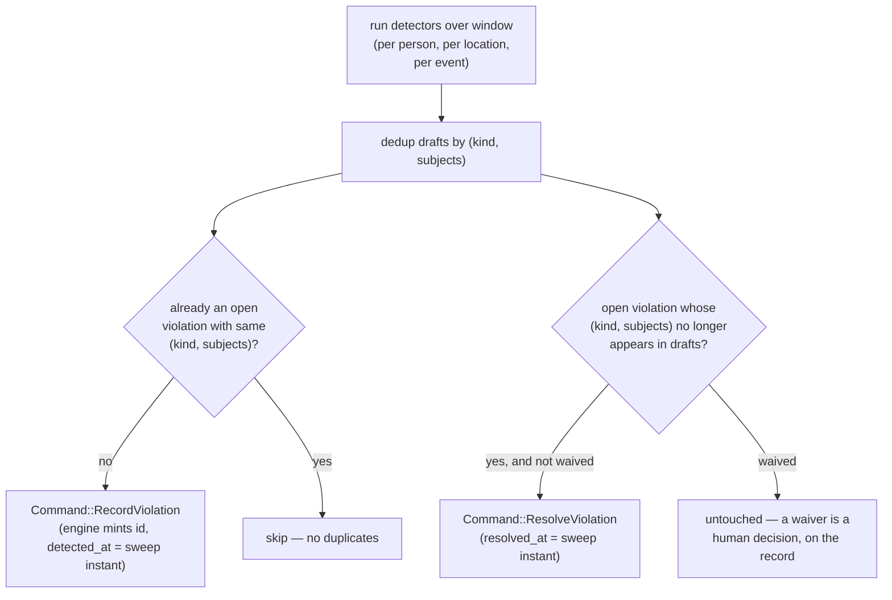
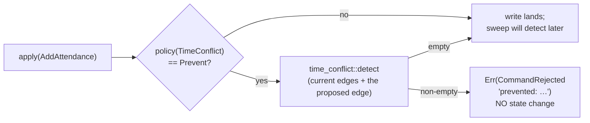

# Phase 3 artifact — Violations, sweeps, Prevent, and the FeasibilityOracle

*State as of 2026-08-02. Code: `crates/orrery/src/{detect,engine}.rs`.
Decisions: ADR-0012 (violations first-class), Rule 00.4 (detection by
default), ADR-0013 (solver stays out).*

## The design stance: a linter would be wrong

"No two events in one room at once" could be a schema constraint. It
deliberately is not (Rule 00.4), for a reason that is mechanical, not
aesthetic: **planning requires transient invalid states.** Dragging an
event between rooms double-books the target for the duration of the drag;
local search over schedules *depends* on traversing infeasible regions
(penalty formulations don't work otherwise). Hard constraints make both
impossible.

So Orrery *detects*: violations are **first-class records with a
lifecycle**, not computed results that vanish on refresh. This is the
difference between a linter and an inbox — and the inbox is the product.



## The seven detectors

Each is a pure function in its own module, property-tested against an
independently-written brute-force oracle. Detectors mint no ids and read no
clocks — they return `ViolationDraft{kind, severity, subjects}`; the engine
assigns identity and time when persisting. Every temporal rule is the same
half-open interval-overlap predicate.

| Detector | Fires when | Partition | Default severity |
|---|---|---|---|
| `time_conflict` | one person, two overlapping attends | person | Hard |
| `location_exclusivity` | one location, two overlapping holds, different events | location | Hard |
| `containment_exclusivity` | a room and its building (transitively) held for different overlapping events | location | Hard |
| `impossible_travel` | consecutive events, gap < travel cost | person | Hard (measured) / Warning (estimated) |
| `capacity_exceeded` | signalled interest > `capacity_override ?? location.capacity` | event | Warning |
| `orphan_event` | event with no hold overlapping its window | event | Info |
| `expired_membership_effect` | cached derived edge whose source membership lapsed | person | Warning |

## How sweeps function, and why

`Engine::sweep(at, window)` is the batch path (PRD Flow B): run the
detectors across the whole population and reconcile the results against the
open violation records — through the command layer, like every other write.



Purpose: sweeps are what keep the **violation inbox** true over time.
"Show unresolved" is an indexed read of open records, not a recompute;
history survives; waivers ("yes, she's presenting remotely from the other
room") stay attached to the exact violation they excuse. Sweeps are
idempotent — the lifecycle tests assert a second identical sweep emits and
resolves nothing.

## How Prevent functions, and why

Policy is a per-kind toggle: `Off / Detect / Warn / Prevent`. `Prevent` is
**the same detector function called at a second call site** — inside the
engine's apply gate, against the prospective post-write state:



One implementation, two call sites — so write-time strictness can never
drift from sweep-time semantics; there is no second definition of
"conflict" to get out of sync. Purpose: some surfaces genuinely want
refusal (say, publishing a finalised conference programme), and they can
opt in per kind without turning the schema rigid for everyone else. The
tests assert both halves: under `Prevent` the conflicting write is rejected
and state is untouched; under `Detect` the identical write lands.

## How the FeasibilityOracle functions, and why

The oracle is the engine's public contract (SPEC-00) and the seam that
keeps the solver out of the engine (ADR-0013):

```rust
pub trait FeasibilityOracle {
    fn is_feasible(&self, a: &Assignment) -> Vec<Violation>;  // what would break?
    fn score(&self, a: &Assignment) -> f64;                   // how bad? (0 = clean)
}
pub struct Assignment {           // a proposed OVERLAY — nothing is written
    pub attends: Vec<Attends>,
    pub held: Vec<Held>,
    pub at: Timestamp,            // caller-supplied — the engine reads no clock
    pub window: Interval,
}
```

`is_feasible` overlays the proposal onto current state (stored ∪ proposed,
per touched person and location), runs the relevant detectors, and returns
the violations that *would* exist — read-only, freshly-minted records,
`detected_at = a.at`. `score` is `−Σ severity_weight` (Hard 100, Warning
10, Info 1): a clean proposal scores 0; every defect pulls it down.
Travel feasibility joins the overlay in Phase 4; richer objectives
(stability, expected attendee travel) belong to the SDK's composition
layer, never here.

Use-case — how the solver consumes it (Phase 5 preview):

```text
// Greedy room assignment probing two candidates for talk T:
let a = Assignment { held: vec![hold(room_a, T)], ..probe };
let b = Assignment { held: vec![hold(room_b, T)], ..probe };
engine.score(&a)   // → -100.0  (room A double-booked: Hard exclusivity)
engine.score(&b)   // →    0.0  (room B clean) → greedy takes B
// Local search later on may deliberately hold states scoring -200
// while climbing out — which is exactly why detection, not prevention,
// is the default.
```

And the interactive path (PRD Flow A): a member ticks a session in Muster →
the app builds a one-edge `Assignment` → violations come back inside the
interactive budget → the UI marks the conflict *before* the member commits,
while committing anyway remains allowed — detection leaves the choice, and
its consequences, on the record.
