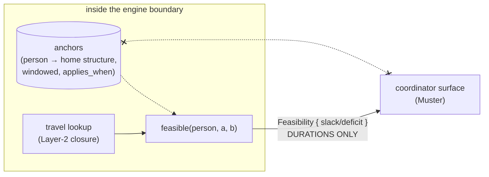

# Phase 4 artifact — The `privacy_` tests: what they check and why

*State as of 2026-08-02. Code: `crates/orrery/tests/engine_behavior.rs`
(`privacy_travel_violation_subjects_are_person_and_events_only`),
`travel::Feasibility`. Binding rules: Rule 00.6 (non-negotiable), Rule 09,
ADR-0014. Runner: `just orrery::test-privacy` (filters on the `privacy_`
name prefix).*

## The threat model, in one sentence

**Personal anchors are home addresses.** `anchors` relations tie a person
to the structure they start and end their day at — needed to answer "can
she make the 8am from home?" — and a coordinator who can see them can see
where every member of their group lives.

Rule 00.6 makes the containment non-negotiable: *personal anchors never
cross the coordinator boundary — verdicts only, enforced at the engine
boundary, asserted by an automated test, not a review checklist.* The
`privacy_` test family is that automated test, growing with each phase
that touches the boundary.

## Why "verdicts only" is a design shape, not a filter

The tempting design is to compute feasibility wherever convenient and
strip coordinates before display. That fails the way redaction always
fails — some path forgets to strip. Orrery inverts it: **feasibility is
computed inside the engine, and the types that cross the boundary are
physically incapable of carrying a location:**

```rust
pub enum Feasibility {
    Feasible   { slack_s: i64 },
    Infeasible { deficit_s: i64, provenance: TravelProvenance },
    Unknown,
}
```

Durations and a data-quality flag. No `LocationId`, no coordinates, no
anchor reference — a coordinator learns *"she cannot make it, short by
25 minutes on estimated data"*, never *from where*. What doesn't exist in
the type cannot leak through any code path, present or future.



## The leak channels, and what guards each

Rule 09 names the *easy* leak explicitly: a `Result::Err` built "for
debugging" that carries a location will end up in a trace exporter. The
guards, channel by channel:

| Channel | Guard | Status |
|---|---|---|
| **Violation subjects** | impossible-travel drafts name `Person` + the two `Event`s — never a location entity | tested now (`privacy_travel_…`) |
| **Verdict values** | `Feasibility` carries durations only — by type construction | asserted by use in the same test |
| **Error values** | `OrreryError` variants carry entity ids and constraint names; no coordinate or address field exists | by construction (Rule 09; watched at review) |
| **Span attributes** | Rule 05 "Never in spans" — exporters ship attributes wholesale; our spans carry ids, counts, backend labels | by convention today; automated span-capture check queued for RC |
| **Data egress** | Parquet/CSV export excludes `anchors` by default; exporting them is a separate, explicit, logged operation | Rule 09; lands with export (Phase 6+) |

## What the current test actually does

`privacy_travel_violation_subjects_are_person_and_events_only`:

1. Builds a world through the engine, sweeps it, and asserts that **every
   `ImpossibleTravel` violation's subject list contains only
   `EntityRef::Person` and `EntityRef::Event` values** — no
   `EntityRef::Location` ever rides along. Violations are the most-copied
   records in the system (inbox, notifications, analytics all consume
   them), so their subject list is the highest-fanout channel to keep
   clean.
2. Exercises `travel::feasible` directly and consumes its verdict —
   pinning the durations-only shape at a use site, so a future field
   addition that leaks location identity breaks a named privacy test, not
   just a review heuristic.

Why travel is where this family starts: travel is the *only* computation
that will ever legitimately read anchors (first/last event of the day),
so its output surface is where containment must hold first. Note the
deliberate asymmetry with rooms: a violation about a double-booked *room*
may name the room — rooms are institutional facts. Anchors are personal
facts; travel violations name no locations at all, which costs nothing
today and means the subjects shape does not change when anchor-based
checks land.

## What's coming (carry-forwards, tracked in phases/04-travel.md)

* **Anchor-consulting feasibility** (first/last event of the day,
  ADR-0014): when it lands, the existing verdict types are already
  location-free — the new privacy tests will assert the *coordinator-side
  payloads* (Muster's DTOs) as well, at the engine boundary.
* **RC gate** (SPEC-03, ROADMAP): the privacy boundary test becomes a
  release gate — "no anchor coordinate appears in any coordinator-facing
  payload", automated end-to-end, plus deterministic-rebuild and
  span-capture checks.
* Waivers and violation history stay PII-clean by the same subject rule
  (actor *ids* and timestamps only — Rule 09).
