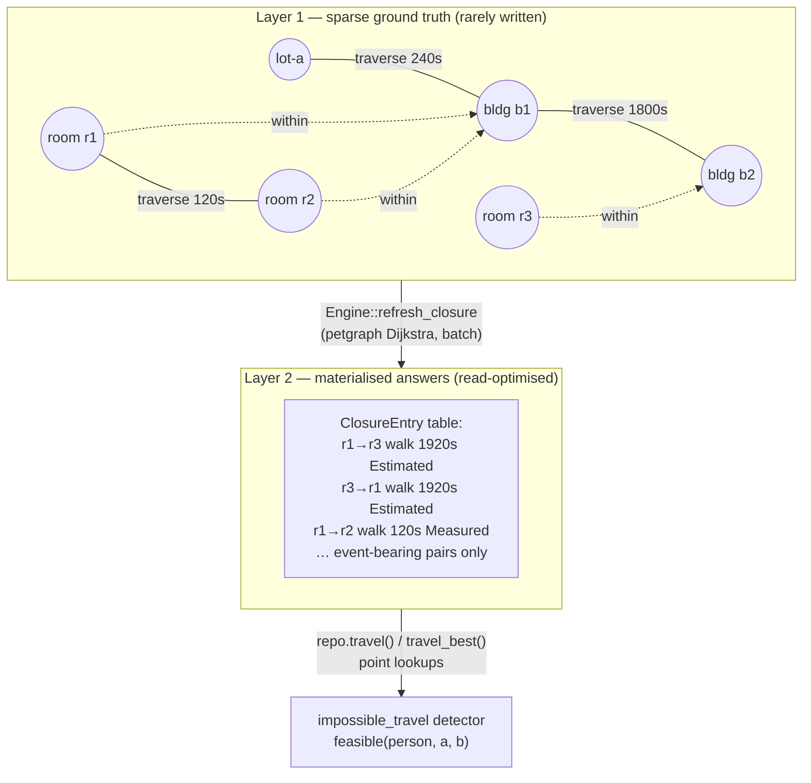
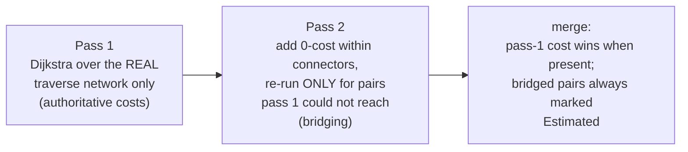

# Phase 4 artifact — The petgraph Layer-2 closure

*State as of 2026-08-02, Phase 4 complete (phases/04-travel.md). Code:
`crates/orrery/src/travel.rs`, `engine.rs::refresh_closure`. Decisions:
ADR-0006 (two layers), ADR-0009 (decomposition), ADR-0008 (two rows).*

## Why two layers exist at all

The design thread caught a contradiction in the original proposal: "every
location connects to every other" (a complete graph of *answers*) and
"some locations exist only as waypoints — bldg-1 → lot-a → lot-b → bldg-2"
(a sparse network needing *pathfinding*). Both can't be one structure. So
(ADR-0006):

Layer 1 is truth: directed `traverse` edges (two rows per pair, written
from one call site so symmetry can't drift — ADR-0008), including waypoint
locations that host no events. Layer 2 is the cache the hot path reads:
all-pairs costs **restricted to event-bearing locations**, batch-recomputed
through `Command::ReplaceClosure` — one atomic replacement, matching the
"large-scale read, small-scale write" profile, and bounding any future
routing-API bill (matrix APIs charge per origin×destination element; 2,000
locations naively = ~4M billable elements per refresh).

## The computation — and the refutation that shaped it

`travel::compute_closure` is pure (no repository, no clock). Per travel
mode, it builds a `petgraph::DiGraph` and runs Dijkstra from each
event-bearing location. Containment (`within`) edges serve as ADR-0009's
decomposition glue — room→exit + building→building + entrance→room — with
exit/entry cost approximated at **0** for v1.

**The pre-committed design was refuted by its own property test on the
first run.** The Floyd–Warshall oracle found two defects in "just add
zero-cost connector edges to the graph":

1. With no traverse edges at all, connectors alone manufactured "travel"
   between nested locations — a route out of bare containment.
2. Worse: free intra-building shortcuts. With rooms a, b inside building x,
   Dijkstra preferred `a → x → b` at **0 s** over the real measured 120 s
   `a → b` edge — silently zeroing all intra-building travel.

The shipped algorithm is two-pass:

The regression is pinned as a named test
(`connectors_do_not_undercut_real_edges`), and the oracle was mirrored to
the corrected semantics — the full story is in phases/04-travel.md H1.
This is the third time in this project a property oracle has refuted a
design before it shipped; that is the mechanism working, not bad luck.

## Provenance rules (what "Estimated" means downstream)

| Entry came from | Provenance | Detector consequence |
|---|---|---|
| shortest cost equals a direct measured edge | `Measured` | impossible-travel fires at **Hard** |
| multi-hop path, or any bridged pair | `Estimated` | fires at **Warning** (SPEC-03: conservative on estimates) |
| no entry, no direct edge | — (`travel()` → `None`) | verdict `Unknown` — **no violation**; an incomplete closure must not accuse |

Lookup path: `repo.travel(from, to, mode)` reads Layer 2 first and falls
back to a direct-edge scan when the cache is empty (degrades to Phase-3
behaviour, never to lies). `travel_best(from, to)` takes the minimum across
modes — detection judges against the *best* option, so nobody is accused
because walking is slow when they could have driven.

## Worked example (conference persona)

Talks T1 (ends 14:00, room r1 in building b1) and T2 (starts 14:15, room
r3 in building b2); buildings 30 min apart on foot.

1. Before any refresh: rooms in different buildings share no direct edge →
   `travel_best` returns `None` → verdict `Unknown` → the sweep emits
   nothing. Silence, not a false accusation.
2. `engine.refresh_closure(EventBearing, at)` — Dijkstra bridges
   r1→b1→b2→r3: 0 + 1800 + 0 = 1800 s, `Estimated`. Report: 2 sources,
   2 pairs (buildings appear on the path, never as endpoints).
3. Next sweep: gap 900 s < cost 1800 s → `ImpossibleTravel` at Warning,
   subjects = person + the two events. The organiser sees it in the inbox;
   a solver probing this placement sees `score` drop by 10.

## Deliberate v1 limits (all recorded as carry-forwards)

Bridged costs under-estimate (doors are free); `transit` (scheduled travel)
stays v2 because a departure-time-dependent cost breaks the scalar cache by
design (ADR-0007); refresh performance vs the 60 s SPEC-03 budget is
unmeasured until Phase 7; `person` in `feasible(person, a, b)` is carried
and ignored until mobility profiles (Rule 00.5 / ADR-0017 — the signature
exists so landing profiles later is a fill-in, not a cache-key migration).
